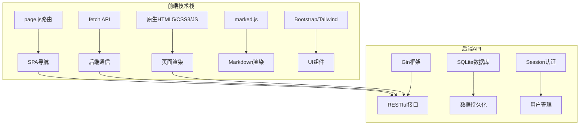
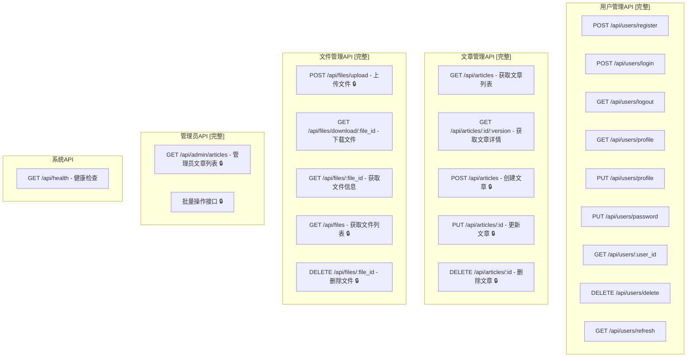
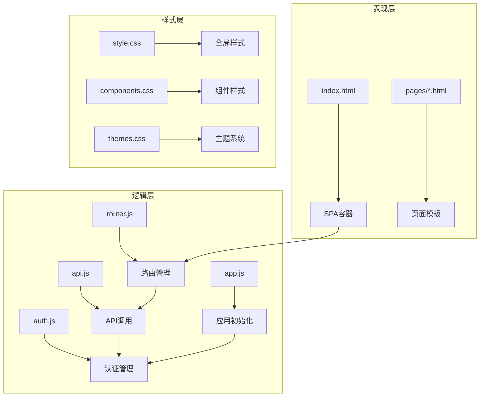
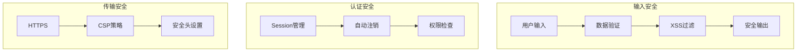
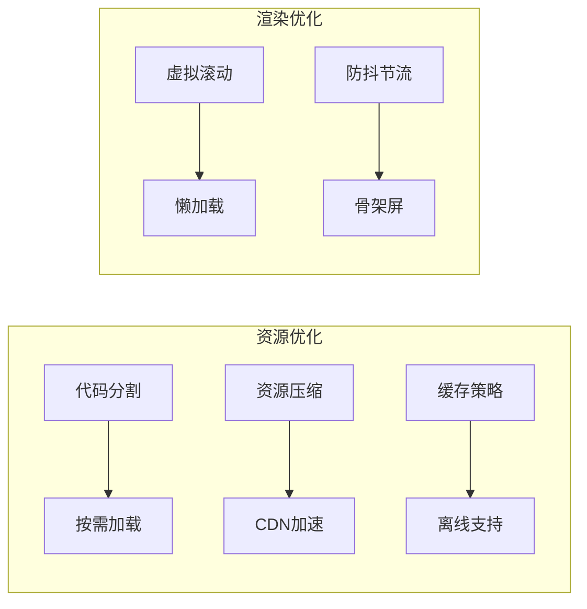
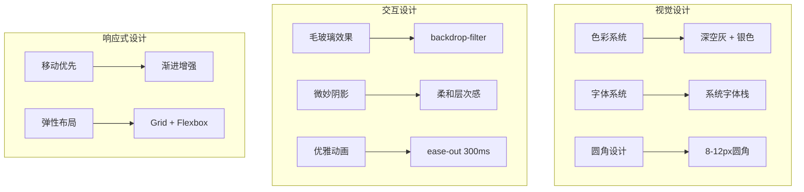
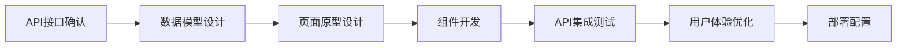

# 个人博客前端开发计划评估与设计建议

## 概述

本文档对个人博客前端开发计划进行全面评估，分析其技术选型的合理性、架构设计的可行性以及开发流程的优先级安排，并基于现有后端 API 架构提供改进建议。

## 计划评估总体结论

**优势方面：**

- 技术选型务实，选择静态页面开发避免了复杂框架的学习成本
- 开发优先级合理，先实现核心功能再完善体验
- UI 设计风格现代化，苹果风格具有良好的用户体验
- 与后端 API 对接方案清晰，保持现有接口不变

**需要改进的方面：**

- 部分技术选型存在兼容性风险
- 文件组织结构可以进一步优化
- 缺少关键的错误处理和性能优化策略
- 开发流程中缺少测试和部署的详细考虑

## 技术架构评估

### 前端技术栈评估



**技术选型合理性分析：**

| 技术组件           | 评估结果  | 原因分析                                 |
| ------------------ | --------- | ---------------------------------------- |
| 原生 JavaScript    | ✅ 合理   | 避免框架依赖，减少学习成本，项目规模适中 |
| page.js 路由       | ✅ 合理   | 轻量级，满足 SPA 路由需求                |
| Bootstrap/Tailwind | ⚠️ 需选择 | 两者功能重叠，建议选择其一               |
| marked.js          | ✅ 合理   | 成熟的 Markdown 解析库                   |
| fetch API          | ✅ 合理   | 现代浏览器原生支持                       |

### 与后端 API 的集成评估

**后端现有 API 接口分析：**



**API 对接方案评估：**

✅ **优点：**

- 用户认证体系完整，支持 Session 管理
- 文章 CRUD 功能完整，支持版本控制
- 文件管理功能齐全，支持上传下载
- 权限控制完善，区分普通用户和管理员
- 所有接口已实现，无需等待后端开发

⚠️ **暂不可用功能：**

- 评论系统（接口未实现）
- 分类系统（接口未实现）
- 文章搜索（接口已注释）
- 热门文章（接口已注释）

## 架构设计评估

### 前端架构设计



**架构设计评估：**

✅ **优势：**

- 分层清晰，职责明确
- 模块化设计便于维护
- 支持主题切换系统

🔧 **改进建议：**

- 增加状态管理模块（state.js）
- 添加工具函数库（utils.js）
- 考虑组件化开发模式

### 文件组织结构优化建议

**当前结构：**

```
web/
├── index.html
├── css/
├── js/
├── pages/
└── assets/
```

**优化后结构：**

```
web/
├── index.html
├── assets/
│   ├── css/
│   │   ├── base.css          # 基础样式
│   │   ├── components.css    # 组件样式
│   │   ├── layout.css        # 布局样式
│   │   └── themes.css        # 主题样式
│   ├── js/
│   │   ├── core/
│   │   │   ├── app.js        # 应用核心
│   │   │   ├── router.js     # 路由管理
│   │   │   ├── state.js      # 状态管理
│   │   │   └── api.js        # API封装
│   │   ├── modules/
│   │   │   ├── auth.js       # 认证模块
│   │   │   ├── article.js    # 文章模块
│   │   │   └── user.js       # 用户模块
│   │   ├── components/
│   │   │   ├── navbar.js     # 导航栏组件
│   │   │   ├── modal.js      # 模态框组件
│   │   │   └── editor.js     # 编辑器组件
│   │   └── utils/
│   │       ├── helpers.js    # 工具函数
│   │       ├── validators.js # 验证函数
│   │       └── constants.js  # 常量定义
│   ├── images/
│   └── icons/
├── templates/               # 页面模板
│   ├── pages/
│   └── components/
└── config/
    └── app.config.js       # 应用配置
```

## 开发优先级评估

### 当前优先级安排分析

```mermaid
gantt
    title 开发优先级时间线
    dateFormat X
    axisFormat %s

    section 高优先级
    项目初始化    :done, init, 0, 1
    文章模块     :done, article, 1, 3
    通用功能     :done, common, 2, 4

    section 中优先级
    用户模块     :active, user, 3, 5
    管理员后台   :admin, 5, 7

    section 低优先级
    收尾工作     :final, 7, 8
```



**优先级评估结果：**

✅ **合理的优先级安排：**

- 先搭建基础架构，再开发具体功能
- 核心功能（文章展示）优先级最高
- 管理功能放在中等优先级

🔧 **优化建议：**

- 将用户认证提升为高优先级（影响其他功能）
- 将基础 UI 组件开发提前
- 增加 API 调试和测试阶段

### 基于现有 API 的开发阶段规划

**第一阶段：基础架构搭建（1 天）**

- 项目初始化和静态文件配置
- 路由系统（page.js）和状态管理
- API 客户端封装和错误处理
- 基础 UI 组件和布局框架
- 主题系统（亮色/暗色模式）

**第二阶段：用户认证系统（1-2 天）**

- 登录注册页面
- Session 认证和权限管理
- 个人资料查看和编辑
- 密码修改功能
- 会话刷新和自动登录检查

**第三阶段：文章展示系统（2-3 天）**

- 文章列表页面（支持分页）
- 文章详情页面（支持版本控制）
- Markdown 渲染和代码高亮
- 文章内容的两步加载机制
- 响应式设计和阅读体验优化

**第四阶段：文件管理系统（1 天）**

- 文件上传组件
- 图片预览和管理
- 文件下载功能
- 文件列表管理（管理员）

**第五阶段：管理后台开发（2-3 天）**

- 管理员仪表板
- 文章编辑器（Markdown + 图片上传）
- 文章的增删改查管理
- 批量操作功能
- 权限控制和安全检查

**第六阶段：优化和完善（1-2 天）**

- 性能优化和错误处理完善
- 响应式设计调整
- 用户体验细节优化
- 静态文件部署配置

## 技术风险评估

### 主要技术风险

| 风险项         | 风险等级 | 影响描述                         | 缓解方案                        |
| -------------- | -------- | -------------------------------- | ------------------------------- |
| 浏览器兼容性   | 🟡 中等  | 原生 JS 在老版本浏览器可能不支持 | 添加 polyfill，设定最低支持版本 |
| SEO 支持       | 🟡 中等  | SPA 对搜索引擎不友好             | 考虑服务端渲染或预渲染方案      |
| 状态管理复杂性 | 🟡 中等  | 原生 JS 状态管理可能变得复杂     | 设计规范的状态管理模式          |
| 安全性         | 🔴 高    | XSS 攻击风险                     | 严格的输入验证和输出转义        |

### 安全性考虑

**前端安全措施：**



**必需的安全措施：**

- 实现内容安全策略（CSP）
- 对用户输入进行严格验证和转义
- 实现 CSRF 防护机制
- 敏感操作添加二次确认

## 性能优化建议

### 加载性能优化



**关键优化策略：**

1. **资源加载优化**

   - 使用 CDN 加载第三方库
   - 实现代码分割和按需加载
   - 启用 Gzip 压缩

2. **渲染性能优化**

   - 实现图片懒加载
   - 使用虚拟滚动处理长列表
   - 添加骨架屏提升用户体验

3. **网络请求优化**
   - 实现请求缓存机制
   - 使用请求合并减少网络开销
   - 添加离线功能支持

## 用户体验设计评估

### UI 设计方案评估

**苹果风格设计系统：**



**设计系统优势：**

- 现代化的视觉风格
- 优秀的可访问性
- 跨平台一致性

**改进建议：**

- 定义完整的设计令牌系统
- 创建组件库文档
- 添加暗色模式切换动画

### 交互体验优化

**关键交互优化：**

1. **加载状态管理**

   - 全局加载指示器
   - 骨架屏占位
   - 进度条反馈

2. **错误处理体验**

   - 友好的错误提示
   - 重试机制
   - 降级方案

3. **响应式交互**
   - 移动端手势支持
   - 键盘导航
   - 无障碍访问

## 改进建议与最佳实践

### 基于现有 API 的架构设计

1. **状态管理优化**

   ```javascript
   // 针对现有API的状态管理结构
   const AppState = {
     user: {
       isAuthenticated: false,
       profile: null, // UserInfo from /api/users/profile
       role: null, // user/admin
     },
     articles: {
       list: [], // from /api/articles
       current: null, // from /api/articles/:id/:version
       currentContent: "", // from /api/files/download/:file_id
       pagination: { page: 1, pageSize: 10, total: 0 },
     },
     files: {
       uploadQueue: [],
       list: [], // from /api/files (admin only)
     },
     ui: {
       theme: "light",
       loading: false,
       notifications: [],
       currentRoute: "",
     },
   };
   ```

2. **API 客户端优化**

   ```javascript
   // 针对现有后端的API客户端
   class ApiClient {
     constructor() {
       this.baseURL = "http://localhost:8080/api";
       this.defaultHeaders = {
         "Content-Type": "application/json",
       };
     }

     async request(endpoint, options = {}) {
       const config = {
         credentials: "include", // 自动携带Session Cookie
         headers: { ...this.defaultHeaders, ...options.headers },
         ...options,
       };

       try {
         const response = await fetch(`${this.baseURL}${endpoint}`, config);
         const data = await response.json();

         if (!response.ok) {
           throw new Error(data.message || "API请求失败");
         }

         return data.data; // 后端统一返回格式中的data字段
       } catch (error) {
         console.error("API请求错误:", error);
         throw error;
       }
     }

     // 用户相关API
     user = {
       register: (data) =>
         this.request("/users/register", {
           method: "POST",
           body: JSON.stringify(data),
         }),
       login: (data) =>
         this.request("/users/login", {
           method: "POST",
           body: JSON.stringify(data),
         }),
       logout: () => this.request("/users/logout"),
       getProfile: () => this.request("/users/profile"),
       updateProfile: (data) =>
         this.request("/users/profile", {
           method: "PUT",
           body: JSON.stringify(data),
         }),
       updatePassword: (data) =>
         this.request("/users/password", {
           method: "PUT",
           body: JSON.stringify(data),
         }),
     };

     // 文章相关API
     articles = {
       getList: (page = 1, pageSize = 10) =>
         this.request(`/articles?page=${page}&pageSize=${pageSize}`),
       getDetail: (id, version) => this.request(`/articles/${id}/${version}`),
       create: (data) =>
         this.request("/articles", {
           method: "POST",
           body: JSON.stringify(data),
         }),
       update: (id, data) =>
         this.request(`/articles/${id}`, {
           method: "PUT",
           body: JSON.stringify(data),
         }),
       delete: (id) => this.request(`/articles/${id}`, { method: "DELETE" }),
     };

     // 文件相关API
     files = {
       upload: (file) => {
         const formData = new FormData();
         formData.append("file", file);
         return this.request("/files/upload", {
           method: "POST",
           body: formData,
           headers: {}, // 移除Content-Type让浏览器自动设置
         });
       },
       download: (fileId) => this.request(`/files/download/${fileId}`),
       getInfo: (fileId) => this.request(`/files/${fileId}`),
       getList: () => this.request("/files"),
       delete: (fileId) =>
         this.request(`/files/${fileId}`, { method: "DELETE" }),
     };
   }
   ```

3. **文章内容的两步加载机制**

   ```javascript
   // 文章详情加载的完整流程
   class ArticleService {
     constructor(apiClient) {
       this.api = apiClient;
     }

     async getArticleDetail(id, version) {
       try {
         // 第一步：获取文章元数据
         const articleMeta = await this.api.articles.getDetail(id, version);

         // 第二步：根据store_id下载文章内容
         if (articleMeta.store_id) {
           const content = await this.api.files.download(articleMeta.store_id);
           return {
             ...articleMeta,
             content: content,
           };
         }

         return articleMeta;
       } catch (error) {
         console.error("获取文章详情失败:", error);
         throw error;
       }
     }

     async publishArticle(title, description, markdownContent, category) {
       try {
         // 第一步：上传Markdown内容作为文件
         const contentBlob = new Blob([markdownContent], {
           type: "text/markdown",
         });
         const contentFile = new File([contentBlob], "article.md", {
           type: "text/markdown",
         });
         const uploadResult = await this.api.files.upload(contentFile);

         // 第二步：创建文章记录
         const articleData = {
           title,
           description,
           store_id: uploadResult.id, // 从上传结果中获取文件ID
           category,
           status: "published",
         };

         return await this.api.articles.create(articleData);
       } catch (error) {
         console.error("发布文章失败:", error);
         throw error;
       }
     }
   }
   ```

4. **基于现有 API 的路由设计**
   ```javascript
   // 路由配置（基于可用的API接口）
   const routes = {
     "/": "pages/home.html", // 首页（文章列表）
     "/login": "pages/login.html", // 登录页
     "/register": "pages/register.html", // 注册页
     "/profile": "pages/profile.html", // 个人资料
     "/articles": "pages/articles.html", // 文章列表
     "/articles/:id/:version": "pages/article-detail.html", // 文章详情
     "/admin": "pages/admin/dashboard.html", // 管理后台首页
     "/admin/articles": "pages/admin/article-list.html", // 文章管理
     "/admin/articles/new": "pages/admin/article-editor.html", // 新建文章
     "/admin/articles/:id/edit": "pages/admin/article-editor.html", // 编辑文章
     "/admin/files": "pages/admin/file-manager.html", // 文件管理
     "/404": "pages/404.html", // 404页面
   };
   ```

### 基于现有 API 的开发流程优化

**推荐的开发工作流：**



**质量保证措施：**

- API 接口测试（使用 Postman Collection）
- 前端功能测试
- 跨浏览器兼容性测试
- 性能监控和错误追踪

### 部署策略建议（基于项目要求）

**后端静态文件服务配置（基于项目要求）：**

根据项目要求，前端需要与后端部署在同一个目录下，整个服务运行在 8080 端口。

```go
// 在 internal/router/router.go 中添加静态文件路由
func InitRouter() *gin.Engine {
    r := gin.Default()

    // 静态资源路由（优先级高于API路由）
    r.Static("/assets", "./web/assets")
    r.Static("/css", "./web/css")
    r.Static("/js", "./web/js")
    r.StaticFile("/", "./web/index.html")

    // API路由组
    api := r.Group("/api")
    // ... 现有API路由配置

    // SPA路由回退（处理前端路由）
    r.NoRoute(func(c *gin.Context) {
        if !strings.HasPrefix(c.Request.URL.Path, "/api") {
            c.File("./web/index.html")
        } else {
            c.JSON(404, gin.H{"error": "API not found"})
        }
    })

    return r
}
```

**前端部署目录结构：**

```
d:/projects/personal_blog/
├── web/                 # 前端静态文件目录
│   ├── index.html      # SPA入口文件
│   ├── assets/         # 静态资源
│   ├── css/           # 样式文件
│   ├── js/            # JavaScript文件
│   └── pages/         # 页面模板
├── internal/          # 后端代码
├── main.go           # 后端主程序
└── ...               # 其他后端文件
```

## 总结与建议

### 整体评估结论

基于对现有后端 API 的分析，您的前端开发计划具有很高的可行性：

✅ **技术基础坚实**：

- 后端 API 接口完整，涵盖了用户管理、文章管理、文件管理的全部功能
- Session 认证机制成熟可靠，支持用户角色权限控制
- 文章内容的两步加载机制设计合理
- 文件上传下载功能完善

✅ **前端设计合理**：

- 原生 JavaScript 技术栈适合项目规模
- 苹果风格 UI 设计现代化
- 模块化的文件组织结构
- 与后端统一部署的方案实用

### 关键成功因素

1. **API 接口完整性**

   - 所有核心功能的 API 已实现
   - 无需等待后端开发，可直接开始前端开发

2. **技术选型务实**

   - 原生技术栈降低了学习成本
   - 选择的第三方库都是成熟稳定的方案

3. **开发优先级明确**
   - 先实现核心功能，再完善体验
   - 管理后台功能放在中等优先级

### 关键改进建议

1. **开发顺序调整**

   - 先实现用户认证系统（影响其他模块）
   - 再开发文章展示功能
   - 最后实现管理后台

2. **技术细节优化**

   - 完善状态管理机制
   - 加强安全防护措施
   - 优化错误处理和用户体验

3. **部署配置完善**
   - 确保静态文件路由配置正确
   - 实现 SPA 路由回退机制

### 最终结论

您的计划整体上是非常合理和可行的。现有的后端 API 已经很完整，完全支持一个功能齐全的个人博客系统。通过针对现有 API 的优化调整，可以构建出一个稳定、高效、用户体验优秀的前端应用。

**建议立即开始开发**，按照优化后的开发阶段进行，预计能在 7-10 个工作日完成一个功能完整的个人博客前端应用。
